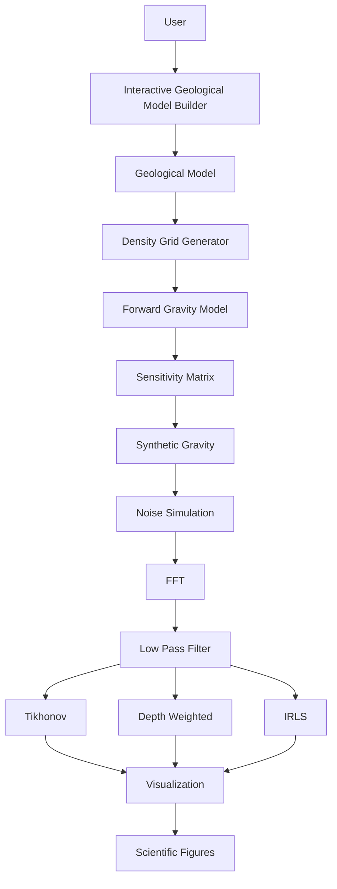
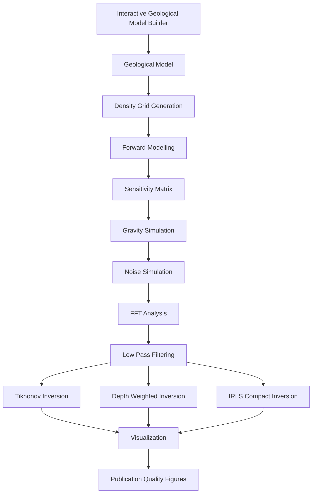
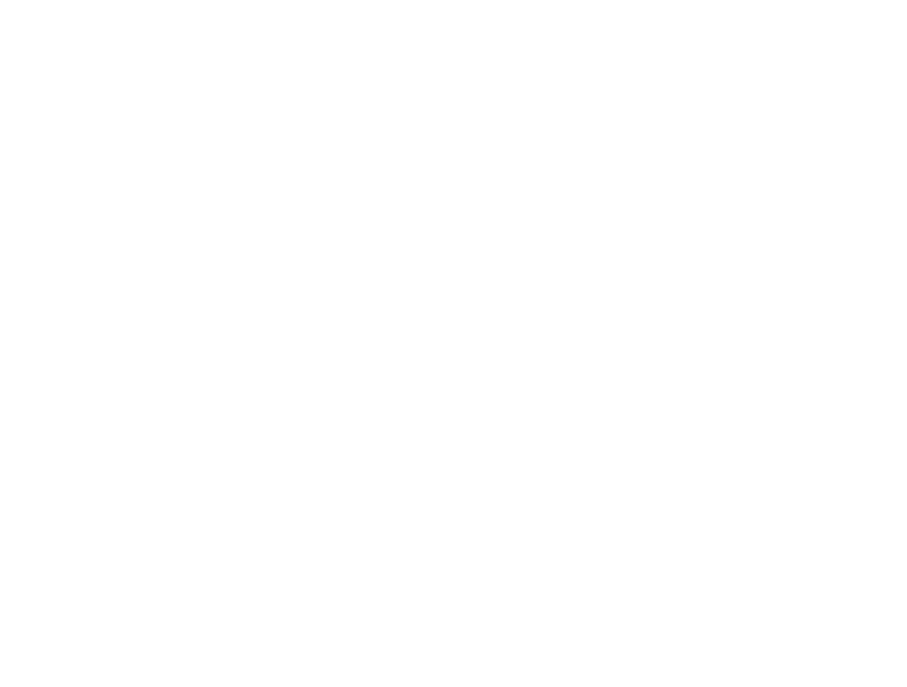
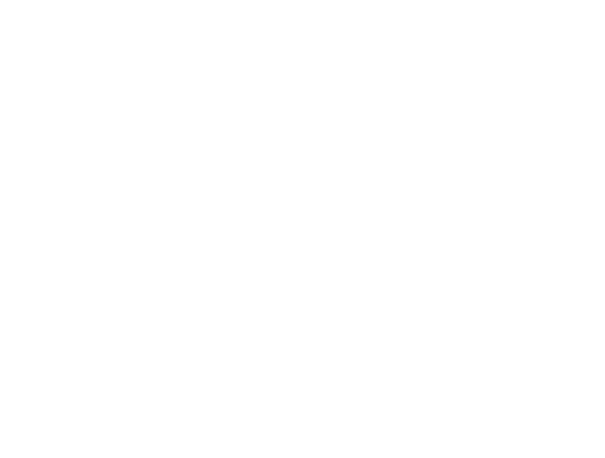
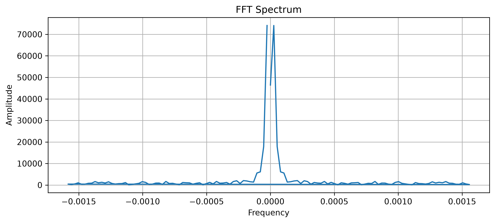
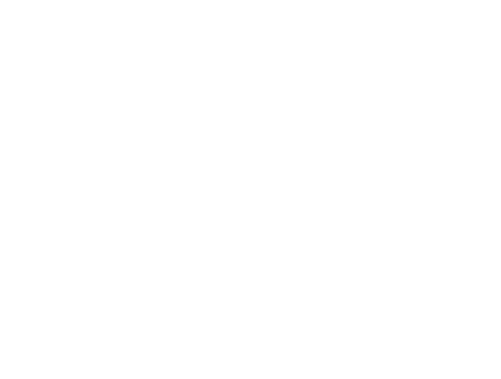
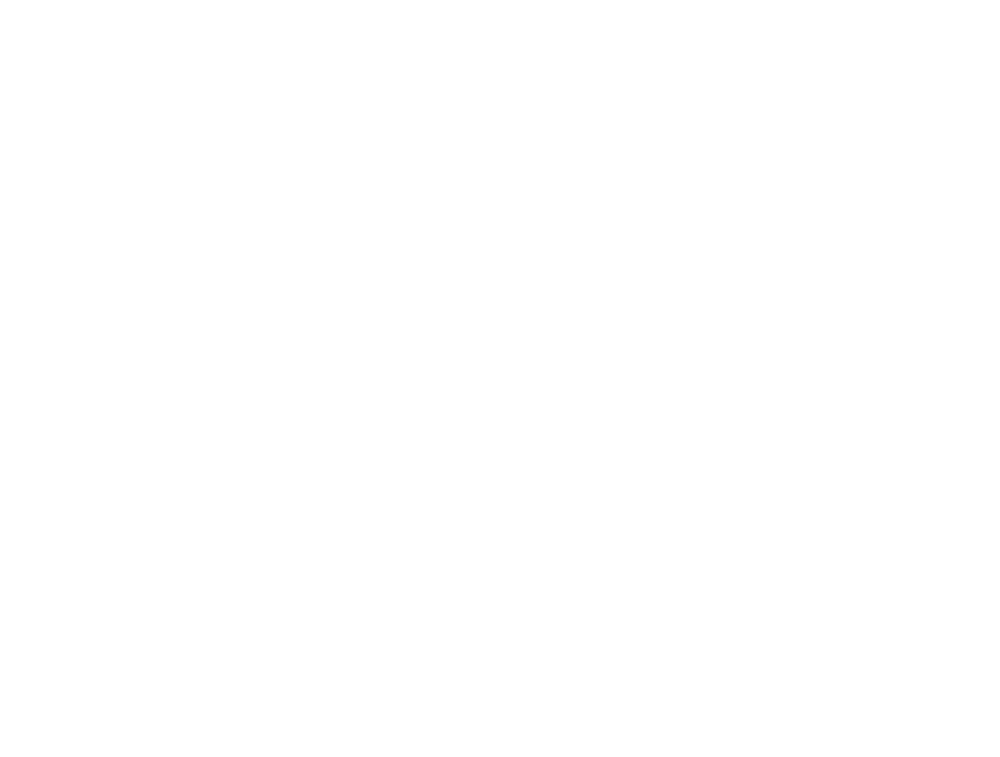

<p align="center">


</p>
# 🌍 GeoGravityLab

> **A Modular Python Framework for 2D Gravity Forward Modelling, Signal Processing and Gravity Inversion**

<p align="center">


</p>

---
---

# 📑 Table of Contents

- [📌 Overview](#-overview)
- [🎯 Project Objectives](#-project-objectives)
- [⭐ Features](#-features)
- [🌍 Why Gravity Exploration?](#-why-gravity-exploration)
- [📖 Mathematical Foundations](#-mathematical-foundations)
  - [🌍 Newton's Law of Gravitation](#-newtons-law-of-gravitation)
  - [🌎 Gravitational Potential](#-gravitational-potential)
  - [📐 Gravity Acceleration](#-gravity-acceleration)
  - [🌍 Linear Forward Problem](#-linear-forward-problem)
  - [🧩 Sensitivity Matrix](#-sensitivity-matrix)
  - [🏔 Geological Model Parameterization](#-geological-model-parameterization)
  - [⚠ Why Gravity Inversion is Difficult](#-why-gravity-inversion-is-difficult)
  - [🎯 Tikhonov Regularization](#-tikhonov-regularization)
  - [⛰ Depth Weighting](#-depth-weighting)
  - [🪨 Iteratively Reweighted Least Squares (IRLS)](#-iteratively-reweighted-least-squares-irls)
  - [📡 Signal Processing](#-signal-processing)
  - [🌊 Low-Pass Filtering](#-low-pass-filtering)
  - [📉 Model Misfit](#-model-misfit)
- [🏗 System Architecture](#-system-architecture)
- [🔄 Complete Computational Workflow](#-complete-computational-workflow)
- [📂 Repository Structure](#-repository-structure)
- [🧩 Source Code Overview](#-source-code-overview)
- [🧠 Object-Oriented Design](#-object-oriented-design)
- [⚙ Forward Modelling Module](#-forward-modelling-module)
- [📡 Signal Processing Module](#-signal-processing-module)
- [🏔 Inversion Module](#-inversion-module)
- [📊 Visualization Module](#-visualization-module)
- [🔬 Software Design Philosophy](#-software-design-philosophy)
- [🚀 Installation](#-installation)
- [▶ Running the Project](#-running-the-project)
- [📊 Individual Demonstrations](#-individual-demonstrations)
- [📷 Generated Figures](#-generated-figures)
- [📈 Typical Output](#-typical-output)
- [🧪 Example Scientific Workflow](#-example-scientific-workflow)
- [💻 Interactive Geological Model Builder](#-interactive-geological-model-builder)
- [📁 Output Directory](#-output-directory)
- [📊 Computational Complexity](#-computational-complexity)
- [📈 Results and Interpretation](#-results-and-interpretation)
- [🛠 Technology Stack](#-technology-stack)
- [🎓 Learning Outcomes](#-learning-outcomes)
- [🔮 Future Work](#-future-work)
- [📚 Scientific References](#-scientific-references)
- [🤝 Contributing](#-contributing)
- [📄 License](#-license)
- [👨‍💻 Author](#-author)
- [🙏 Acknowledgements](#-acknowledgements)
- [⭐ Support the Project](#-support-the-project)

---

# 📌 Overview

GeoGravityLab is a research-oriented Python framework developed for simulating, processing, and inverting gravity data generated by subsurface geological bodies.

The project demonstrates the complete computational workflow used in gravity exploration, beginning with geological model construction and ending with inversion-based recovery of density distributions.

Unlike traditional notebook implementations, GeoGravityLab follows a modular software architecture where every stage of the workflow is isolated into reusable Python modules. This makes the framework suitable for experimentation, education, and future research extensions.

The project integrates concepts from:

* Exploration Geophysics
* Potential Field Theory
* Gravity Forward Modelling
* Scientific Computing
* Signal Processing
* Numerical Optimization
* Inverse Problems

---

# 🎯 Project Objectives

GeoGravityLab was developed with the following objectives:

* Simulate gravity anomalies generated by multiple subsurface bodies.
* Construct gravity sensitivity matrices for forward modelling.
* Investigate the influence of measurement noise.
* Apply frequency-domain signal processing techniques.
* Implement multiple gravity inversion algorithms.
* Compare inversion strategies under identical geological scenarios.
* Demonstrate production-style scientific software engineering practices.

---

# ⭐ Features

### Geological Modelling

* Interactive geological model builder
* Configurable single-body models
* Multi-body geological scenarios
* User-defined density contrasts
* Adjustable body geometry

### Gravity Forward Modelling

* Sensitivity matrix generation
* Numerical gravity simulation
* Surface gravity anomaly computation
* Configurable observation geometry

### Signal Processing

* Gaussian noise simulation
* Fast Fourier Transform (FFT)
* Frequency spectrum analysis
* Low-pass filtering
* Signal reconstruction using inverse FFT

### Gravity Inversion

* Tikhonov Regularization
* Depth-Weighted Inversion
* Iteratively Reweighted Least Squares (IRLS)
* Residual analysis
* Model comparison

### Visualization

The framework automatically generates:

* Geological density models
* Gravity anomaly profiles
* FFT spectra
* Filtered gravity responses
* True vs recovered density models
* Comparative inversion figures
* Convergence plots

---

# 🌍 Why Gravity Exploration?

Gravity exploration is a passive geophysical technique that measures small variations in the Earth's gravitational field caused by changes in subsurface density.

Dense geological structures produce positive gravity anomalies, whereas lower-density bodies generate negative anomalies.

By measuring these anomalies at the surface and solving the associated inverse problem, geophysicists can estimate the geometry and density distribution of buried structures.

Typical applications include:

* Mineral Exploration
* Petroleum Exploration
* Salt Dome Detection
* Basin Analysis
* Engineering Site Investigation
* Groundwater Studies
* Crustal Structure Analysis

GeoGravityLab reproduces this workflow using numerical forward modelling and inversion techniques implemented entirely in Python.
---

# 📖 Mathematical Foundations

Gravity inversion is a classical **ill-posed inverse problem** in exploration geophysics. The objective is to estimate the subsurface density distribution responsible for the measured gravity anomalies.

GeoGravityLab implements the complete computational workflow beginning with geological model construction, followed by forward modelling, signal processing, and numerical inversion.

---

# 🌍 Newton's Law of Gravitation

The gravitational attraction between two masses is governed by Newton's Law of Gravitation

[
F = G\frac{m_1m_2}{r^2}
]

where

| Symbol    | Description                      |
| --------- | -------------------------------- |
| (F)       | Gravitational force              |
| (G)       | Universal gravitational constant |
| (m_1,m_2) | Masses                           |
| (r)       | Distance between the masses      |

Although this equation describes the interaction between two point masses, gravity exploration involves the cumulative effect of millions of mass elements distributed throughout the subsurface.

---

# 🌎 Gravitational Potential

The gravitational potential generated by a continuous density distribution is

[
U(\mathbf r)=
G
\int_V
\frac{\rho(\mathbf r')}{|\mathbf r-\mathbf r'|}
,dV
]

where

* (U) is the gravitational potential,
* (\rho) is the density distribution,
* (V) represents the subsurface volume.

The observed gravity field is obtained from the gradient of the potential.

---

# 📐 Gravity Acceleration

The gravitational acceleration is computed as

[
\mathbf g=\nabla U
]

Only the vertical component of gravity is considered in this project because gravity surveys primarily measure vertical acceleration.

---

# 🌍 Linear Forward Problem

After discretising the subsurface into rectangular cells, gravity forward modelling can be written as

[
\boxed{
\mathbf d=\mathbf G\mathbf m
}
]

where

| Symbol      | Meaning                     |
| ----------- | --------------------------- |
| (\mathbf d) | Observed gravity anomaly    |
| (\mathbf G) | Sensitivity (kernel) matrix |
| (\mathbf m) | Density contrast model      |

Each element of the sensitivity matrix describes the contribution of one model cell to one observation location.

This matrix is constructed numerically inside the **ForwardModel** module.

---

# 🧩 Sensitivity Matrix

The sensitivity matrix contains the response of every model cell at every observation point.

Its dimensions are

[
\mathbf G
\in
\mathbb R^{N_d\times N_m}
]

where

* (N_d) = number of gravity observations
* (N_m) = number of model cells

Every row corresponds to one observation point, while every column represents one subsurface cell.

Once the matrix has been assembled, forward modelling reduces to a single matrix multiplication.

---

# 🏔 Geological Model Parameterization

The subsurface is discretised into rectangular cells,

[
m=
\begin{bmatrix}
\rho_1\
\rho_2\
\vdots\
\rho_n
\end{bmatrix}
]

where each model parameter represents the density contrast assigned to one cell of the computational mesh.

This discretisation enables complex geological scenarios containing multiple bodies with different geometries and density contrasts.

---

# ⚠ Why Gravity Inversion is Difficult

The gravity inverse problem is **ill-posed** because many different density distributions can produce nearly identical gravity anomalies.

Mathematically,

[
N_m \gg N_d
]

where

* (N_m) is the number of unknown density parameters,
* (N_d) is the number of gravity observations.

Consequently,

* the inverse problem is non-unique,
* small measurement errors may produce unstable solutions,
* regularization becomes essential.

GeoGravityLab therefore implements multiple inversion techniques to stabilize the recovered model.

---

# 🎯 Tikhonov Regularization

The classical Tikhonov objective function is

[
\phi(m)
=======

|Gm-d|^2
+
\lambda^2
|m|^2
]

where

* the first term minimizes the data misfit,
* the second term stabilizes the inversion,
* (\lambda) controls the trade-off between data fitting and model smoothness.

The corresponding normal equation is

[
\boxed{
m=
(G^TG+\lambda^2I)^{-1}
G^Td
}
]

This inversion provides smooth and numerically stable density models.

---

# ⛰ Depth Weighting

Gravity sensitivity decreases rapidly with depth.

Without compensation, inversion algorithms tend to place excessive density close to the surface.

GeoGravityLab applies depth weighting using

[
W(z)
====

\left(
\frac{z_0}{z}
\right)^\beta
]

where

* (z) denotes model depth,
* (z_0) is a reference depth,
* (\beta) controls the weighting strength.

This improves recovery of deeper geological bodies.

---

# 🪨 Iteratively Reweighted Least Squares (IRLS)

IRLS introduces adaptive model weighting to promote compact density distributions.

The compactness weights are computed as

[
W_c=
\frac{1}
{\sqrt{
m^2+\varepsilon^2
}}
]

The inversion system is updated iteratively as

[
(G^TG+\lambda W)m
=================

G^Td
]

where the weighting matrix is recomputed after every iteration until convergence.

---

# 📡 Signal Processing

Synthetic gravity observations may contain measurement noise.

GeoGravityLab therefore includes frequency-domain processing based on the Fast Fourier Transform.

The discrete Fourier transform is

[
F(k)=
\sum_{n=0}^{N-1}
x_n
e^{-i2\pi kn/N}
]

This transformation converts gravity data from the spatial domain into the frequency domain, allowing unwanted high-frequency noise to be identified and filtered.

---

# 🌊 Low-Pass Filtering

High-frequency noise components are removed by applying a low-pass filter in the frequency domain.

The filtered signal is reconstructed using the inverse Fourier transform, providing a smoother gravity anomaly prior to inversion.

---

# 📉 Model Misfit

The agreement between observed and predicted gravity anomalies is evaluated using the Root Mean Square Error (RMSE)

[
RMSE=
\sqrt{
\frac1N
\sum_{i=1}^{N}
(d_i^{obs}-d_i^{pred})^2
}
]

Lower RMSE values indicate better agreement between simulated observations and the recovered model.

Throughout the inversion process, RMSE is monitored to evaluate convergence and reconstruction quality.
---

# 🏗 System Architecture


GeoGravityLab follows a modular object-oriented architecture where each computational stage is implemented as an independent Python module.

This design improves maintainability, scalability, and reproducibility while allowing individual algorithms to be extended without affecting the rest of the framework.



---

# 🔄 Complete Computational Workflow

The complete computational pipeline implemented inside GeoGravityLab is illustrated below.

```text
Interactive Model Builder
          │
          ▼
Create Geological Bodies
          │
          ▼
Generate Density Grid
          │
          ▼
Construct Sensitivity Matrix
          │
          ▼
Forward Gravity Modelling
          │
          ▼
Synthetic Gravity Data
          │
          ▼
Add Gaussian Noise
          │
          ▼
Fast Fourier Transform
          │
          ▼
Frequency Filtering
          │
          ▼
Inverse Fourier Transform
          │
          ▼
Gravity Inversion
          │
          ▼
Recovered Density Model
          │
          ▼
Scientific Visualization
```

---

# 📂 Repository Structure

```text
GeoGravityLab/

│

├── examples/
│   ├── interactive_model.py
│   ├── forward_model_demo.py
│   ├── tikhonov_demo.py
│   ├── depth_weighted_demo.py
│   ├── irls_demo.py
│   └── generate_figures.py

│

├── reports/
│   └── figures/

│

├── src/

│   ├── models/
│   │   ├── body.py
│   │   └── geological_model.py

│   ├── inversion/
│   │   ├── base.py
│   │   ├── tikhonov.py
│   │   ├── depth_weighted.py
│   │   └── irls.py

│   ├── signal_processing/
│   │   ├── filters.py
│   │   ├── spectral.py
│   │   └── noise.py

│   ├── forward_model.py
│   ├── geological_models.py
│   ├── visualization.py
│   ├── pipeline.py
│   ├── evaluation.py
│   ├── domain.py
│   ├── constants.py
│   └── config.py

│

├── main.py

├── requirements.txt

├── README.md
```

---

# 🧩 Source Code Overview

Every module in GeoGravityLab has a dedicated responsibility.

The project has been designed according to the principle of **single responsibility**, allowing algorithms to be modified independently.

| Module                   | Responsibility                                                                |
| ------------------------ | ----------------------------------------------------------------------------- |
| **main.py**              | Executes the complete gravity modelling workflow                              |
| **interactive_model.py** | Builds geological models interactively                                        |
| **body.py**              | Represents a rectangular geological body                                      |
| **geological_model.py**  | Stores multiple geological bodies                                             |  
| **geological_models.py** | Converts geological bodies into density grids                                 | 
| **domain.py**            | Generates computational meshes and observation points                         | 
| **forward_model.py**     | Constructs the gravity sensitivity matrix and performs forward modelling      | 
| **pipeline.py**          | Integrates all modelling, processing and inversion stages                     | 
| **noise.py**             | Generates Gaussian measurement noise                                          |  
| **spectral.py**          | Computes FFT and frequency spectra                                            | 
| **filters.py**           | Performs frequency-domain filtering                                           |
| **tikhonov.py**          | Implements Tikhonov regularized inversion                                     | 
| **depth_weighted.py**    | Implements depth-weighted inversion                                           |
| **irls.py**              | Implements experimental Iteratively Reweighted Least Squares (IRLS) inversion |
| **visualization.py**     | Generates scientific figures and comparisons                                  |
| **evaluation.py**        | Computes inversion performance metrics                                        |

---

# 🧠 Object-Oriented Design

The software has been designed using object-oriented programming principles.

The primary classes are

```text
Body

↓

GeologicalModel

↓

GeologicalModelBuilder

↓

ForwardModel

↓

GravityPipeline

↓

GravityVisualizer
```

Each class encapsulates a specific stage of the gravity inversion workflow, improving readability and reducing code duplication.

---

# ⚙ Forward Modelling Module

The forward modelling stage converts the geological density model into synthetic gravity observations.

The workflow consists of

```text
Density Grid

↓

Flatten Density Model

↓

Construct Sensitivity Matrix

↓

Matrix Multiplication

↓

Gravity Anomaly
```

Mathematically,

[
\mathbf d=\mathbf G\mathbf m
]

where

* **G** is generated numerically,
* **m** is the density model,
* **d** is the predicted gravity anomaly.

---

# 📡 Signal Processing Module

Real gravity observations contain measurement noise.

The signal processing module provides

```text
Synthetic Gravity

↓

Noise Simulation

↓

FFT

↓

Frequency Spectrum

↓

Low Pass Filter

↓

Inverse FFT
```

allowing investigation of the effect of frequency filtering on inversion accuracy.

---

# 🏔 Inversion Module

The inversion package implements three independent inversion algorithms.

```text
Observed Gravity

↓

Tikhonov

↓

Depth Weighting

↓

IRLS

↓

Recovered Density Model
```

Each inversion algorithm shares the same interface, making comparative studies straightforward.

---

# 📊 Visualization Module

GeoGravityLab automatically generates publication-quality scientific figures.

The visualization module includes

* Geological Density Models
* Gravity Profiles
* Frequency Spectra
* Residual Analysis
* Observed vs Predicted Gravity
* True vs Recovered Models
* Comparative Inversion Figures
* Convergence Curves

All figures are saved automatically inside

```text
reports/
└── figures/
```

allowing results to be reproduced with a single command.

---

# 🔬 Software Design Philosophy

GeoGravityLab was designed around four fundamental principles:

### Reproducibility

Every result can be regenerated directly from the source code.

---

### Modularity

Each computational component is implemented independently.

---

### Extensibility

New inversion algorithms or forward kernels can be integrated without modifying the existing architecture.

---

### Scientific Transparency

The mathematical formulation used throughout the project closely follows classical gravity inversion literature, ensuring that each computational step can be traced back to its theoretical foundation.
---

# 🚀 Installation

Clone the repository

```bash
git clone https://github.com/<YOUR_USERNAME>/GeoGravityLab.git

cd GeoGravityLab
```

---

## Create a Virtual Environment

### Windows

```bash
python -m venv venv

venv\Scripts\activate
```

### Linux / macOS

```bash
python3 -m venv venv

source venv/bin/activate
```

---

## Install Dependencies

```bash
pip install -r requirements.txt
```

---

# ▶ Running the Project

GeoGravityLab provides several independent demonstration scripts.

---

## 1️⃣ Complete Interactive Workflow

Run

```bash
python main.py
```

The program will ask for

```text
Model Name

↓

Number of Geological Bodies

↓

Body Parameters

• Name
• X Position
• Depth
• Width
• Height
• Density Contrast
```

The complete gravity modelling workflow is then executed automatically.

---

## Example Input

```text
Model Name : Demo

Number of Geological Bodies : 2

Body 1

Name : Ore Body

X Center : 2000

Depth : 800

Width : 600

Height : 400

Density : 450

Body 2

Name : Salt Dome

X Center : 4200

Depth : 1200

Width : 900

Height : 700

Density : -350
```

---

## Workflow Performed

Running

```bash
python main.py
```

performs the following computations automatically.

```text
Interactive Geological Model

↓

Density Grid Generation

↓

Sensitivity Matrix Construction

↓

Gravity Forward Modelling

↓

Noise Simulation

↓

Fast Fourier Transform

↓

Low Pass Filtering

↓

Tikhonov Inversion

↓

Depth Weighted Inversion

↓

IRLS Inversion

↓

Scientific Visualization
```

---

# 📊 Individual Demonstrations

Every stage of the workflow can also be executed independently.

## Forward Modelling

```bash
python -m examples.forward_model_demo
```

Generates synthetic gravity anomalies from user-defined geological models.

---

## Tikhonov Inversion

```bash
python -m examples.tikhonov_demo
```

Demonstrates smooth gravity inversion using classical Tikhonov regularization.

---

## Depth Weighted Inversion

```bash
python -m examples.depth_weighted_demo
```

Demonstrates inversion with depth weighting to improve recovery of deeper structures.

---

## IRLS Inversion

```bash
python -m examples.irls_demo
```

Demonstrates compact inversion using the Iteratively Reweighted Least Squares algorithm.

---

## Generate All Figures

```bash
python -m examples.generate_figures
```

Automatically generates publication-quality figures and stores them in

```text
reports/
└── figures/
```

---

# 📷 Generated Figures
## Density Model

<p align="center">



</p>

---

## Gravity Anomaly

<p align="center">



</p>

---

## FFT Spectrum

<p align="center">



</p>

---

## Filtered Gravity

<p align="center">



</p>

---

## Inversion Comparison

<p align="center">



</p>

Executing

```bash
python -m examples.generate_figures
```

creates several figures for interpretation.

| Figure               | Description                             |
| -------------------- | --------------------------------------- |
| Density Model        | Subsurface density distribution         |
| Gravity Anomaly      | Simulated gravity response              |
| FFT Spectrum         | Frequency-domain representation         |
| Filtered Gravity     | Gravity signal after low-pass filtering |
| Inversion Comparison | Comparison of inversion algorithms      |
| Convergence Plot     | IRLS convergence history                |

These figures are automatically saved in

```text
reports/
└── figures/
```

and are regenerated every time the script is executed.

---

# 📈 Typical Output

The framework generates results similar to

```text
Density Model

↓

Gravity Anomaly

↓

Observed vs Predicted Gravity

↓

Frequency Spectrum

↓

Filtered Gravity

↓

Recovered Density Model

↓

Algorithm Comparison
```

Each figure is generated using Matplotlib and is suitable for reports, presentations, and scientific documentation.

---

# 🧪 Example Scientific Workflow

A typical modelling study proceeds as follows.

```text
Define Geological Bodies

↓

Generate Computational Grid

↓

Assign Density Contrasts

↓

Compute Gravity Response

↓

Add Synthetic Measurement Noise

↓

Transform to Frequency Domain

↓

Filter Noise

↓

Recover Density Distribution

↓

Compare True and Recovered Models

↓

Interpret Geological Structure
```

---

# 💻 Interactive Geological Model Builder

GeoGravityLab includes an interactive command-line interface for constructing geological models without modifying the source code.

Users can specify

* Number of geological bodies
* Horizontal position
* Burial depth
* Width
* Height
* Density contrast

allowing rapid construction of synthetic geological scenarios.

---

# 🧩 Example Terminal Session

```text
==========================================================
GeoGravityLab Interactive Geological Model Builder
==========================================================

Model Name : Synthetic Example

Number of Geological Bodies : 2

-----------------------------------------
Body 1
-----------------------------------------

Name : Ore Body

X Center : 2000

Depth : 800

Width : 600

Height : 400

Density Contrast : 450

-----------------------------------------
Body 2
-----------------------------------------

Name : Salt Dome

X Center : 4200

Depth : 1200

Width : 900

Height : 700

Density Contrast : -350

Generating Density Grid ...

Building Sensitivity Matrix ...

Forward Modelling Completed.

Applying Noise ...

Performing FFT ...

Filtering Signal ...

Running Tikhonov Inversion ...

Running Depth Weighted Inversion ...

Running IRLS Inversion ...

Generating Figures ...

Finished Successfully.
```

---

# 📁 Output Directory

After successful execution, the repository structure becomes

```text
reports/

└── figures/

    ├── density_model.png

    ├── gravity_anomaly.png

    ├── fft_spectrum.png

    ├── filtered_gravity.png

    ├── inversion_comparison.png

    └── convergence_plot.png
```

These outputs can be directly used in reports, presentations, or further analysis.
---

# 📊 Computational Complexity

The computational complexity of the major components of GeoGravityLab is summarized below.

| Module                          | Complexity     | Description                                              |
| ------------------------------- | -------------- | -------------------------------------------------------- |
| Density Grid Generation         | **O(N)**       | Assign density values to computational cells             |
| Sensitivity Matrix Construction | **O(M × N)**   | Compute gravity response for every observation–cell pair |
| Forward Gravity Modelling       | **O(M × N)**   | Matrix-vector multiplication                             |
| FFT                             | **O(M log M)** | Frequency-domain transformation                          |
| Low-Pass Filtering              | **O(M)**       | Frequency filtering                                      |
| Tikhonov Inversion              | **O(N³)**      | Linear system solution                                   |
| Depth Weighted Inversion        | **O(N³)**      | Regularized inversion                                    |
| IRLS Inversion                  | **O(KN³)**     | Iterative weighted inversion                             |

where

* **M** = Number of gravity observations
* **N** = Number of model cells
* **K** = Number of IRLS iterations

---

# 📈 Results and Interpretation

GeoGravityLab produces several outputs that aid the interpretation of subsurface geological structures.

### Geological Density Model

Represents the true distribution of density contrasts used during forward modelling.

---

### Gravity Anomaly

Shows the synthetic gravity response generated by the forward model.

Positive anomalies generally indicate higher-density bodies, while negative anomalies correspond to lower-density structures.

---

### Frequency Spectrum

The Fourier spectrum provides insight into the frequency content of the gravity signal and assists in selecting appropriate filtering parameters.

---

### Filtered Gravity Signal

Low-pass filtering removes high-frequency noise while preserving the primary geological signal used during inversion.

---

### Inversion Results

The recovered density models illustrate how different regularization techniques influence the inversion.

* **Tikhonov Regularization** generally produces smooth density distributions.
* **Depth Weighted Inversion** improves recovery of deeper geological bodies.
* **IRLS Compact Inversion** promotes compact models through iterative weighting. The current implementation is included as an experimental inversion strategy for further refinement.

---

# 🛠 Technology Stack

| Category                | Technologies       |
| ----------------------- | ------------------ |
| Programming Language    | Python             |
| Scientific Computing    | NumPy              |
| Linear Algebra          | NumPy.linalg       |
| Visualization           | Matplotlib         |
| Signal Processing       | NumPy FFT          |
| Development Environment | Visual Studio Code |
| Version Control         | Git, GitHub        |
| Documentation           | Markdown           |

---

# 🎓 Learning Outcomes

Development of GeoGravityLab involved the implementation of concepts from multiple disciplines.

### Exploration Geophysics

* Gravity Survey Design
* Density Contrast Modelling
* Forward Gravity Modelling
* Gravity Inversion

---

### Mathematics

* Linear Algebra
* Matrix Factorization
* Numerical Optimization
* Least Squares Methods
* Regularization Theory

---

### Signal Processing

* Fourier Transform
* Frequency Analysis
* Noise Modelling
* Digital Filtering

---

### Scientific Computing

* Numerical Programming
* Matrix Computations
* Computational Modelling
* Scientific Visualization

---

### Software Engineering

* Object-Oriented Programming
* Modular Software Architecture
* Code Reusability
* Documentation
* Reproducible Research

---

# 🔮 Future Work

The current framework has been intentionally designed to support future extensions.

Possible research directions include

### Forward Modelling

* Polygonal body gravity modelling
* Talwani forward modelling
* 3D gravity modelling
* Magnetic forward modelling

---

### Inversion

* Sparse L₁ Regularization
* Total Variation (TV) Regularization
* Occam Inversion
* Bayesian Gravity Inversion
* Joint Gravity–Magnetic Inversion

---

### Performance

* GPU acceleration using CUDA
* Parallel sensitivity matrix computation
* Sparse matrix implementation
* Distributed inversion

---

### Visualization

* Interactive 3D visualization
* Geological cross-section viewer
* Real-time inversion dashboard
* Web-based visualization interface

---

# 📚 Scientific References

The mathematical formulation implemented in GeoGravityLab is based on classical literature in gravity modelling and inverse problems.

1. Blakely, R. J. *Potential Theory in Gravity and Magnetic Applications*. Cambridge University Press.

2. Kearey, P., Brooks, M., & Hill, I. *An Introduction to Geophysical Exploration*.

3. Tikhonov, A. N., & Arsenin, V. Y. *Solutions of Ill-Posed Problems*. Winston & Sons.

4. Li, Y., & Oldenburg, D. W. (1996). *3-D inversion of magnetic data*. Geophysics.

5. Last, B. J., & Kubik, K. (1983). *Compact gravity inversion*. Geophysics.

6. Menke, W. *Geophysical Data Analysis: Discrete Inverse Theory*.

---

# 🤝 Contributing

Contributions that improve the scientific accuracy, computational performance, or usability of GeoGravityLab are welcome.

Possible contribution areas include

* New inversion algorithms
* Alternative forward kernels
* Performance optimization
* Improved visualization
* Additional benchmark models
* Documentation improvements

---

# 📄 License

This project is released under the **MIT License**.

You are free to use, modify, and distribute the software in accordance with the terms of the license.

---

# 👨‍💻 Author

**AvionicS-7**

B.S. (4-Year) — Exploration Geophysics

Indian Institute of Technology Kharagpur

### Areas of Interest

* Exploration Geophysics
* Scientific Computing
* Gravity & Magnetic Methods
* Machine Learning for Earth Sciences
* Numerical Optimization
* Computational Geoscience

---

# 🙏 Acknowledgements

This project was developed as a self-driven exploration of computational geophysics with the objective of transforming traditional notebook-based gravity modelling workflows into a modular, maintainable, and extensible scientific software framework.

The project draws inspiration from classical geophysical inversion literature and modern scientific computing practices.

---

# ⭐ Support the Project

If you found GeoGravityLab useful for learning, research, or teaching, consider giving the repository a **⭐ Star** on GitHub.

Your support helps improve the project and encourages future development.

---

<p align="center">

### 🌍 GeoGravityLab

**Exploring the Subsurface Through Computational Geophysics**

</p>
